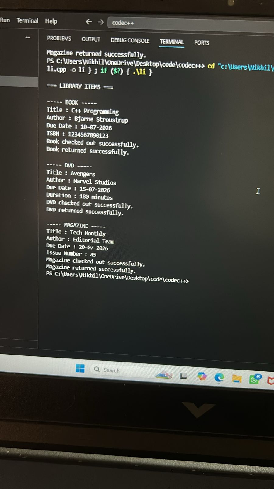

# LIBRARY-MANAGMENT-SYSTEM
Project Overview

The Library Management System is a C++ Object-Oriented Programming (OOP) project that demonstrates the use of Abstraction, Encapsulation, Inheritance, Polymorphism, Exception Handling, and Dynamic Memory Allocation.

The system manages different types of library items such as Books, DVDs, and Magazines through a common abstract base class called LibraryItem.

Features
Add and manage different library items.
Display item details.
Check out library items.
Return library items.
Validate user input using exception handling.
Demonstrate runtime polymorphism using base class pointers.
Use dynamic memory allocation for item management.
OOP Concepts Implemented
1. Class and Object

Classes are created for:

LibraryItem (Abstract Base Class)
Book
DVD
Magazine

Objects of derived classes are created dynamically.

2. Abstraction

LibraryItem is an abstract class containing pure virtual functions:

virtual void checkOut() = 0;
virtual void returnItem() = 0;
virtual void displayDetails() const = 0;
3. Encapsulation

Data members are declared private and accessed using getters and setters.

private:
    string title;
    string author;
    string dueDate;
4. Inheritance

Derived classes inherit from LibraryItem.

class Book : public LibraryItem
class DVD : public LibraryItem
class Magazine : public LibraryItem
5. Polymorphism

An array of base class pointers stores different item types.

LibraryItem* libraryItems[MAX_ITEMS];
6. Exception Handling

The project validates:

ISBN length
DVD duration
Magazine issue number
throw invalid_argument("ISBN must contain 13 digits.");
7. Dynamic Memory Allocation

Objects are created using new and deleted using delete.

libraryItems[count++] = new Book(...);

delete libraryItems[i];
Class Structure
LibraryItem (Abstract Class)
│
├── Book
├── DVD
└── Magazine
Project Files
LibraryManagementSystem
│
├── main.cpp
├── README.md
└── output.png
How to Run
Compile
g++ main.cpp -o library
Execute
./library

For Windows:

library.exe
# Sample Output
.
